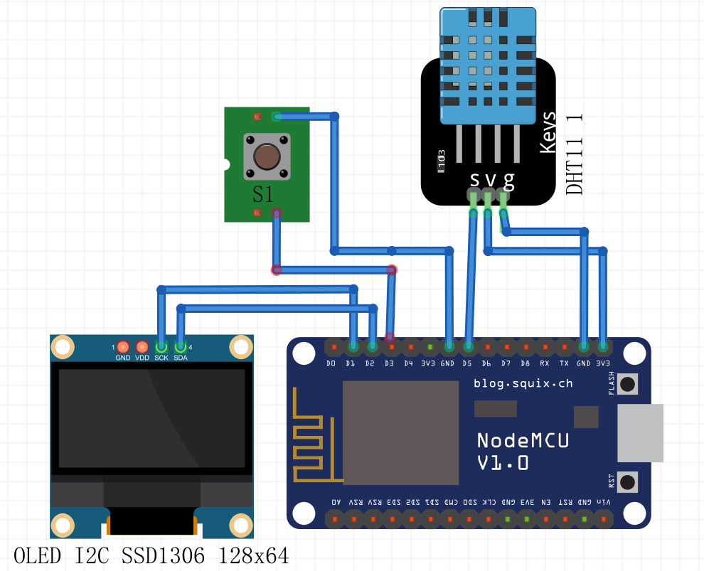
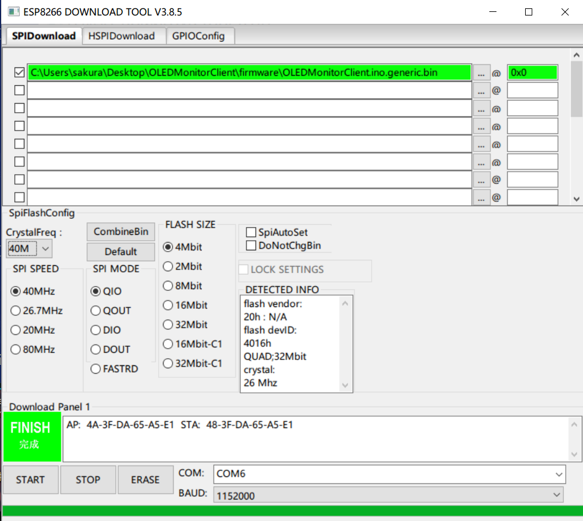

# ESP8266-OLEDMonitor客户端

基于ESP8266MCU的主机系统信息监视器

## 介绍

这个项目可以检测电脑主机的详细系统信息,包括但不限于CPU频率,CPU占用率,内存...

服务端用nodejs编写,使用https://systeminformation.io/ 模块作为获取系统信息的来源,得益于nodejs的跨平台性,以及systeminformation强大的兼容性,理论上可以在Linux, macOS, Windows, FreeBSD, OpenBSD, NetBSD ,SunOS 上使用.

- [x] 监控主机信息
- [x] 监控天气信息(气象站)

## 安装

**1.材料清单**

| ESP8266 NodeMCU开发板               | 1块  | 必选 |
| ----------------------------------- | ---- | ---- |
| SSD1306 128x64 I2C OLED屏幕         | 1块  | 必选 |
| 按钮                                | 1个  | 必选 |
| DHT11传感器(如果需要测量室内温湿度) | 1个  | 可选 |
|                                     |      |      |

**2.线路连接**

**3.使用乐鑫flash_download_tool工具刷入已发行的.bin二进制文件https://github.com/sakura-he/OLEDMonitorClient/releases
**

## 使用

### 开启服务端

**1.服务端(被监控主机)安装好nodejs 并从https://github.com/sakura-he/OLEDMonitorServer 项目中克隆服务端解压,并进入**

**2.修改服务端文件夹的`index.js`文件中的备注修改服务端端口的代码为你想要的使用的端口(默认为553)**

**3.运行`node index.js`开启服务端**

## 配置客户端(ESP8266)

**1.ESP8266启动后连接名为OLEDMonitorClient的WiFi,密码为12345678**

**2.进入http://192.168.4.1 进行配置**

​	1.输入监控主机所在网段的WiFiSSID,WiFi密码后点击提交

​	2.输入监控主机的内网地址,以及端口号(需要在服务端进行设置端口号)后点击提交

​	3.(可选)在心知天气官网申请一个免费的api秘钥,在城市文本框中输入"ip"两个字母或你所在的城市	拼音后提交,进行天气信息监控

**3.配置完成**

## 操作说明

**点按按钮**来在主机监控和天气监控中切换.**长按按钮**直到指示灯**闪烁后松开**,进入调节监控项目切换时间界面,此界面下点按按钮进行调节,长按直到指示灯闪烁后松开退出界面

## TODO

- [ ] 服务端使用JSON配置

- [ ] 网页配置界面优化

- [ ] 加入HomeKit
